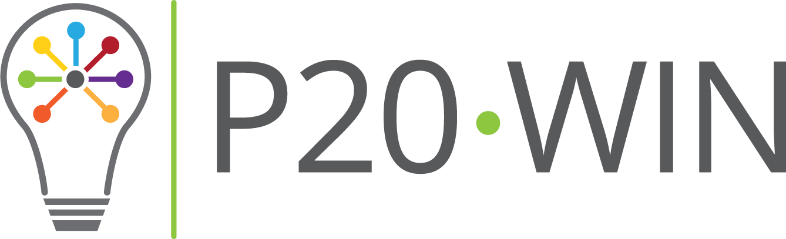

## About the P20 WIN Data Governance Manual 

Data governance can be defined as both an organizational process and a structure; it establishes responsibility for data, organizing program area staff to collaboratively and continuously improve data quality through the systematic creation and enforcement of policies, roles, responsibilities, and procedures. As a structure, clear and specific roles and responsibilities are assigned and staff are held accountable for the quality of the data they manage. Ultimately though, data governance is not about who is in charge: it is about identifying existing or potential data problems and fixing them to prevent them from happening or recurring. As a continuous and iterative process, data governance is a systematic way of handling data throughout the information life cycle, from definition to retirement. 

The P20 WIN Data Governance Manual details the structure, processes, roles and responsibilities that define its governance. <!-- The framework also introduces interagency data standards and key research objectives to assist Connecticut stakeholders appreciate P20 WIN.--> This manual expands on the previous P20 WIN Data Governance Policy, which empowered the P20 WIN Data Governing Board to develop more detailed standards and processes for data management. This is a living document, and will be updated as agency and state priorities evolve. If a new policy is created or an existing policy changed, the Manual will be updated to include a copy of the new policy for reference.

<!-- State agencies and organizations that share data through P20 WIN are considered Participating Agencies in P20 WIN and are accountable to the processes as defined herein; however this is not a legal document. This manual is to be used as a roadmap when making decisions concerning the collection, integration, and use of the P20 WIN system, and it will be consistently evaluated for effectiveness. -->

## Vision and Purpose

Connecticut developed P20 WIN so that multiple, interagency datasets could be linked securely and simultaneously to create longitudinal views of student experiences into the workforce. Since 2014, the P20Win system has produced interagency data linkages for over [twenty projects](https://portal.ct.gov/OPM/P20Win/Reports).  

The following list delineates key goals and deliverables for P20 WIN: 
1. Establish a longitudinal data system that includes supportive services, secondary and postsecondary education, and pathways into the workforce.
2. Institute clear high-level, agency-wide sponsorship of data governance
3. Integrate accountability for successful data management throughout all levels of each Participating Agency.
4. Ensure data security for confidential information at rest and during transmission and the protection of individual privacy. 
5. Provide clear definitions of user roles, system access and approval processes.
6. Link data to address policy questions that would otherwise remain unanswered, through the development of a shared research agenda. 
7. Introduce governance flexibility to include additional data points and datasets.

In order to successfully coordinate and secure authorized access to data through P20 WIN within state and federal laws and regulations, documents and processes have been developed and approved by participants to the system. 

* The **Enterprise Memorandum of Understanding (eMOU)** is a process document that establishes the governance structure, specifies privacy, breach notification and security requirements, determines the Data Sharing Process, and offers guidance when adding new agencies and changing or updating system processes. The Commissioner or chief executive for each participating agency signs the eMOU to join P20 WIN.
* The **Data Sharing Agreement (DSA)** is a formal document between the data recipient and each Participating Agency once a Data Request has been approved. This document outlines the specific regulations that define how data are able to be used, responsibilities of each entity in the DSA, specific privacy and security requirements. Exhibits to the DSA include: the approved Data Request form, agency user acknowledgement, confidentiality agreements, data destruction, and the eMOU.
  
<!-- * This **Data Governance Manual** develops additional policies and procedures such as the processes to secure and authorize access to joined data. Embedded in this manual are forms to facilitate record-keeping and tracking of decisions pertaining to each data request. The manual includes a blank Data Sharing Request form and a template Data Sharing Agreement that is to be completed for each Data Request. -->